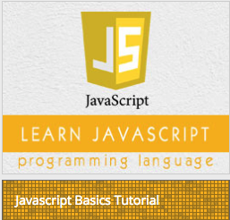

```
Roberto Nogueira  
BSd EE, MSd CE
Solution Integrator Experienced - Certified by Ericsson
```
# Tutorialspoint Javascript Tutorial



**About This Tutorial**

This is to grasp rapidly the language and its concepts.

[C++ Tutorial](https://www.tutorialspoint.com/javascript/index.htm))

#### Topics
```
Javascript Basics Tutorial
[ ] Javascript - Home
[ ] Javascript - Overview
[ ] Javascript - Syntax
[ ] Javascript - Enabling
[ ] Javascript - Placement
[ ] Javascript - Variables
[ ] Javascript - Operators
[ ] Javascript - If...Else
[ ] Javascript - Switch Case
[ ] Javascript - While Loop
[ ] Javascript - For Loop
[ ] Javascript - For...in
[ ] Javascript - Loop Control
[ ] Javascript - Functions
[ ] Javascript - Events
[ ] Javascript - Cookies
[ ] Javascript - Page Redirect
[ ] Javascript - Dialog Boxes
[ ] Javascript - Void Keyword
[ ] Javascript - Page Printing
JavaScript Objects
[ ] Javascript - Objects
[ ] Javascript - Number
[ ] Javascript - Boolean
[ ] Javascript - Strings
[ ] Javascript - Arrays
[ ] Javascript - Date
[ ] Javascript - Math
[ ] Javascript - RegExp
[ ] Javascript - HTML DOM
JavaScript Advanced
[ ] Javascript - Error Handling
[ ] Javascript - Validations
[ ] Javascript - Animation
[ ] Javascript - Multimedia
[ ] Javascript - Debugging
[ ] Javascript - Image Map
[ ] Javascript - Browsers
IMS DB Resources
[ ] Javascript - Questions And Answers
[ ] Javascript - Quick Guide
[ ] Javascript - Functions
[ ] Javascript - Resources
Selected Reading
[ ] Developer's Best Practices
[ ] Questions and Answers
[ ] Effective Resume Writing
[ ] HR Interview Questions
[ ] Computer Glossary
[ ] Who is Who
```

